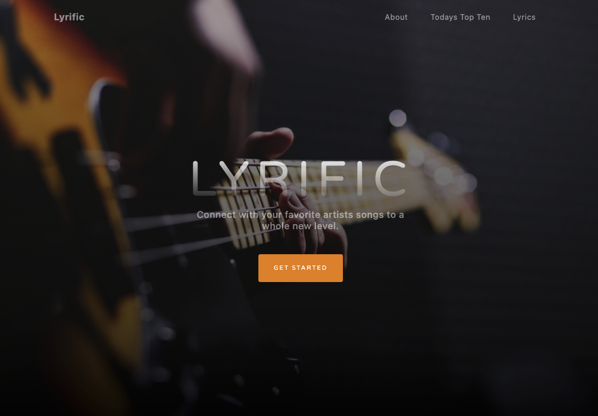

# music-project-main / Lyrific

## Description

Our team loves music, so we decided to make an app targeting the users who love music like we do... karaoke singers. Wanting to implement historical music data as well as live music trending data we employed two APIs: Last.FM and Musixmatch. With this data our users can view the top songs of that moment, but also easily find and read their lyrics. The search feature doesn't stop there, you can search any artist or song in the Musixmatch database and see their lyrics as well.

We saw and met many challenges in this development project. Finding just the right API to match up with was our first challenge. Our second was dealing with Github, and was our main takeaway lesson of the importance of version control. We all look forward to improving this critical skill to streamline our projects.

## Table of Contents

- [Installation](#installation)
- [Usage](#usage)
- [Credits](#credits)
- [License](#license)

## Installation

There is nothing to install for this application, simply visit out github site: <https://dereklewis.github.io/music-project-main/>

## Usage

Lyrific is a very simple, but complex web application. Use the top navigation bar links to navigate your way down the page. Click the "About" link to learn about Lyrific itself. Click the "Today's Top Ten" link to view the top ten songs at that very moment (try it again next week and it might be COMPLETELY different). Or select the "Lyrics" link (or the get started button) to be taken to the Lyrific search tool. Select to search for an artist and view their albums, navigate to their songs, and access lyrics; or search for a specific song and view its lyrics immediately.

For example a user might:

1. Click the Today's Top 10 link and be taken to the most popular songs of today.
2. Select the newest Olivia Rodrigo from the list and type the song name into the Search field. NOTE: Direct Linking coming in a future release.
3. Choose the song radio and click Search.
4. Find the results returned instantaneously, and select the Click Here for Lyrics button.
5. Find the lyrics presented in front of them and begin Karaoke preparation.

md

## Credits

We would like to thank our TAs, Laura and Zac, for helping us work through code issues and Git issues. We would also like to thank or instructor Ben for his useful lectures, and his one on one attention assisting us with APIs.

Thank you also to the people at Mozilla Development Network (https://developer.mozilla.org/en-US/), W3 Schools (https://www.w3schools.com/), Jquery Documentation (https://api.jquery.com), Bootstrap (https://getbootstrap.com/), MusixMatch (https://developer.musixmatch.com/), and Last.FM (https://www.last.fm/api).

## License

MIT License

Copyright (c) [2021] [Derek Lewis, Edgar Calderon, Kevin Kim, Bill Hennessey]

Permission is hereby granted, free of charge, to any person obtaining a copy
of this software and associated documentation files (the "Software"), to deal
in the Software without restriction, including without limitation the rights
to use, copy, modify, merge, publish, distribute, sublicense, and/or sell
copies of the Software, and to permit persons to whom the Software is
furnished to do so, subject to the following conditions:

The above copyright notice and this permission notice shall be included in all
copies or substantial portions of the Software.

THE SOFTWARE IS PROVIDED "AS IS", WITHOUT WARRANTY OF ANY KIND, EXPRESS OR
IMPLIED, INCLUDING BUT NOT LIMITED TO THE WARRANTIES OF MERCHANTABILITY,
FITNESS FOR A PARTICULAR PURPOSE AND NONINFRINGEMENT. IN NO EVENT SHALL THE
AUTHORS OR COPYRIGHT HOLDERS BE LIABLE FOR ANY CLAIM, DAMAGES OR OTHER
LIABILITY, WHETHER IN AN ACTION OF CONTRACT, TORT OR OTHERWISE, ARISING FROM,
OUT OF OR IN CONNECTION WI
